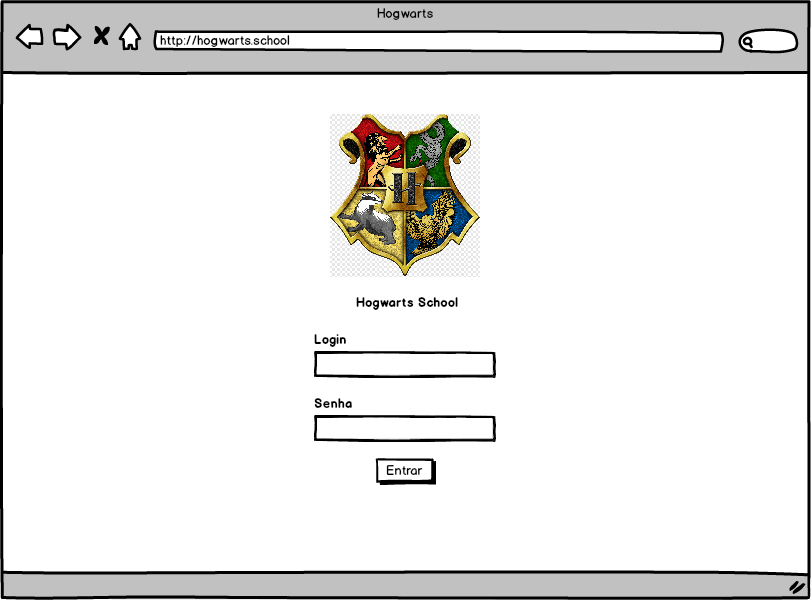
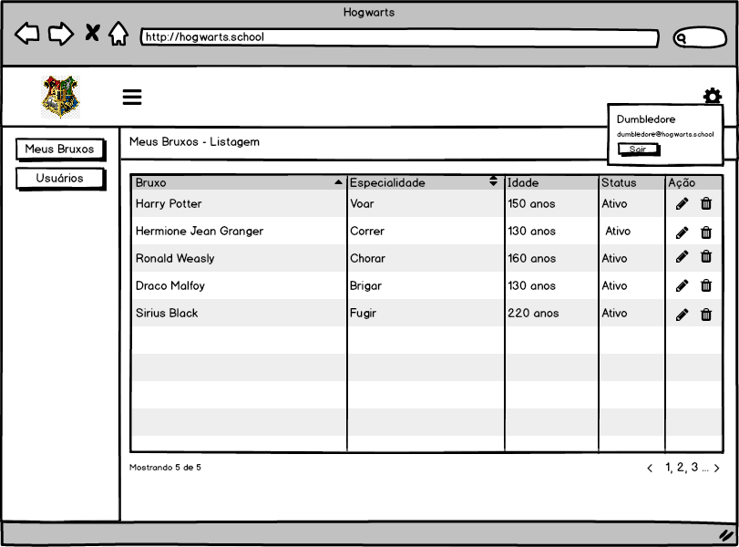
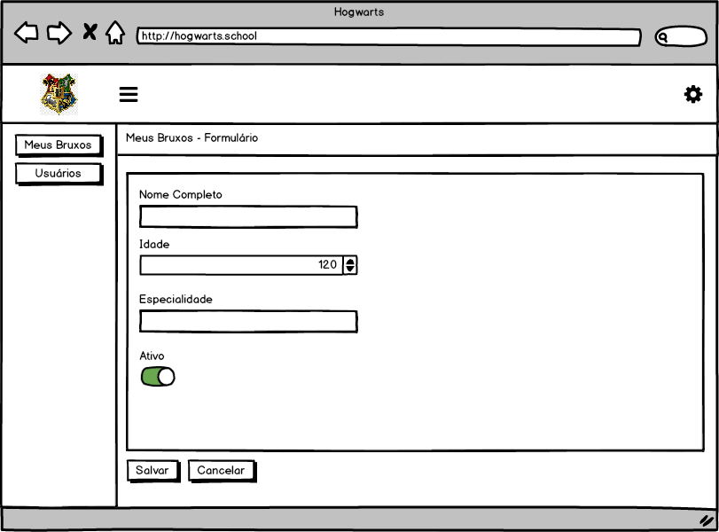

# Desafio de programação - Hogwarts

A idéia deste desafio é nos permitir avaliar melhor as habilidades de candidatos à vagas de programador, de vários níveis.

## Requisitos para rodar o projeto
1. NodeJs
2. MySQL

## Configuração do ambiente
1. Clone o projeto para uma pasta de sua preferência.
2. Crie uma nova tabela em seu banco de dados, chamada hogwarts.
3. Renomeie o arquivo **/backend/.env.example** para, **.env**.
4. Altere as variáveis de conexão com o banco de dados no arquivo **.env**(DB_HOST, DB_USERNAME, DB_PASSWORD).
5. Abra o terminal, dentro da pasta do backend e execute os seguintes comandos em ordem:
```shell
  npm install
  npm start
```
6. Em um novo terminal, dentro da pasta backend, execute o seguinte comando:
```shell
  npm typeorm:migration:run
```
7. Acesse a pasta do dashboard pelo terminal e execute os seguintes comandos em ordem:
```shell
  npm install
  npm start
```

**Credenciais de acesso:**
login: dumbledore@hogwarts.school
senha: dumbledore

## Instruções de entrega do desafio

1. Faça um fork deste projeto para sua conta do github (crie uma se você não possuir).
2. Em seguida, implemente o projeto tal qual descrito abaixo, em seu próprio fork.
3. Por fim, empurre todas as suas alterações para o seu fork no Github e envie um pull request para este repositório original.

## Instruções alternativas de entrega do desafio (caso você não queira que sua submissão seja pública)
1. Faça um clone deste repositório.
2. Em seguida, implemente o projeto tal qual descrito abaixo, em seu clone local.
3. Por fim, envie via email um arquivo patch para seu contato na Lidere Sistemas. 

## Descrição do Projeto
O professor Dumbledore está precisando de um aplicativo para cadastrar todos os seus bruxo-alunos!

Você está disposto a ajudar?

Desenhamos as telas para você se basear, este aplicativo deve ser desenvolvido utilizando as seguintes tecnologias:
- PHP 7+ puro ou utilizando alguns dos frameworks (Slim 2+, Laravel 5+ ou CodeIgniter 3+)
- MySQL para o Banco de Dados.
- Front-end pode ser com bootstrap.

## Tela de Login



## Listagem dos Bruxos



## Formulário




### Avaliação
Seu projeto será avaliado de acordo com os seguintes critérios:
1. Sua aplicação preenche os requerimentos básicos?
2. Você documentou a maneira de configurar o ambiente e rodar sua aplicação?
3. Você seguiu as instruções de envio do desafio?

### Avaliação Pontual
Pontualmente estaremos avaliando:

1. Entendimento sobre a linguagem utilizada.
2. Conhecimentos sobre HTML/CSS/JS.
3. Conhecimentos gerais sobre aplicações a estrutura utilizada.
4. Familiaridade com versionadores de código (Git).
5. Proatividade em buscar conhecimentos novos.
